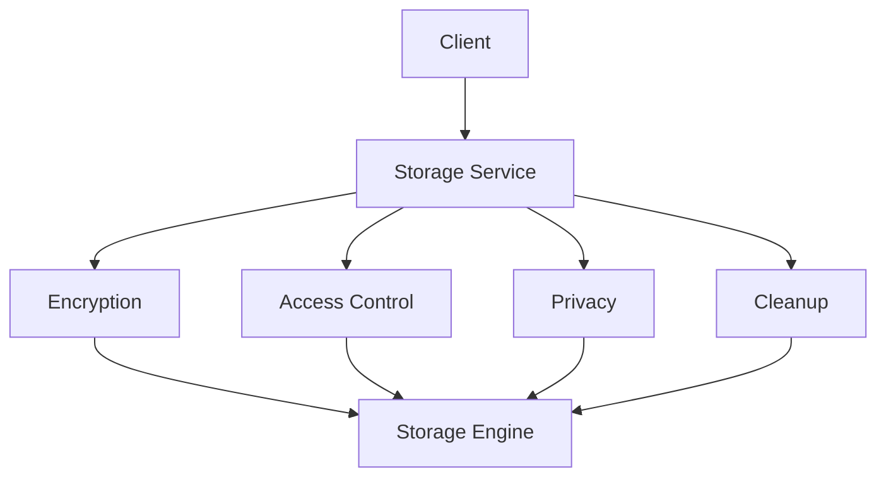

# Secure Storage Service

A TypeScript/Next.js implementation of a secure, privacy-focused storage service with encryption, access control, and GDPR compliance.

## Features

### 🔐 Security

- End-to-end encryption using AES-256-GCM
- Key rotation and management
- Data integrity verification
- Secure data deletion

### 🔑 Access Control

- Role-based access control (RBAC)
- User-specific permissions
- Access logging and auditing
- Resource ownership management

### 🔒 Privacy

- GDPR compliance built-in
- Consent management
- Data retention policies
- Geographic restrictions
- Data subject rights (DSAR) support

### 🧹 Data Lifecycle

- Automatic data cleanup
- Retention policy enforcement
- Secure deletion
- Data archiving

## Getting Started

### Prerequisites

- Node.js 18+
- TypeScript 5+
- Next.js 14+

### Installation

```bash
npm install
```

### Environment Variables

Create a `.env.local` file:

```env
NEXT_PUBLIC_ENCRYPTION_KEY=your-32-byte-encryption-key
```

### Development

```bash
npm run dev
```

### Testing

```bash
npm run test
```

## Architecture

### Core Services

1. **EncryptionService**

   - Handles data encryption/decryption
   - Manages key rotation
   - Ensures data integrity

2. **AccessControlService**

   - Manages user permissions
   - Handles role-based access
   - Logs access attempts

3. **PrivacyService**

   - Manages user consent
   - Handles GDPR compliance
   - Manages retention policies

4. **DataCleanupService**
   - Handles secure deletion
   - Manages cleanup schedules
   - Handles data archiving

### Data Flow



## Security Considerations

### Encryption

- AES-256-GCM encryption
- Secure key derivation (scrypt)
- Integrity verification
- Random IV generation

### Access Control

- Role hierarchy
- Resource ownership
- Access logging
- Audit trails

### Privacy

- Consent tracking
- Data minimization
- Purpose limitation
- Geographic restrictions

## Error Handling

### Types of Errors

1. **Security Errors**

   - Encryption failures
   - Access denied
   - Invalid permissions

2. **Privacy Errors**

   - Missing consent
   - Invalid legal basis
   - Geographic restrictions

3. **System Errors**
   - Storage failures
   - Network issues
   - Resource constraints

### Error Recovery

- Automatic retry with backoff
- Graceful degradation
- User-friendly messages
- Detailed logging

## Testing

### Unit Tests

- Service-level testing
- Component isolation
- Mock implementations

### Integration Tests

- Service interactions
- End-to-end flows
- Error scenarios

### Security Tests

- Encryption verification
- Access control validation
- Privacy compliance

## Deployment Checklist

### Security

- [ ] Encryption key rotation plan
- [ ] Access control audit
- [ ] Privacy policy review
- [ ] Security headers

### Performance

- [ ] Load testing
- [ ] Stress testing
- [ ] Resource monitoring
- [ ] Cleanup optimization

### Compliance

- [ ] GDPR documentation
- [ ] Cookie policy
- [ ] Terms of service
- [ ] Privacy notices

### Operations

- [ ] Monitoring setup
- [ ] Logging configuration
- [ ] Backup strategy
- [ ] Disaster recovery

## Contributing

Please read [CONTRIBUTING.md](CONTRIBUTING.md) for details on our code of conduct and the process for submitting pull requests.

## License

This project is licensed under the MIT License - see the [LICENSE.md](LICENSE.md) file for details.

## TODO

### Security Enhancements

- [ ] Implement key rotation schedule
- [ ] Add rate limiting
- [ ] Enhance audit logging
- [ ] Add intrusion detection

### Feature Additions

- [ ] Multi-factor authentication
- [ ] Backup/restore functionality
- [ ] Enhanced monitoring
- [ ] Analytics dashboard

### Documentation

- [ ] API documentation
- [ ] Security guidelines
- [ ] Deployment guide
- [ ] User manual

### Testing

- [ ] Performance tests
- [ ] Load tests
- [ ] Security penetration tests
- [ ] Compliance tests
