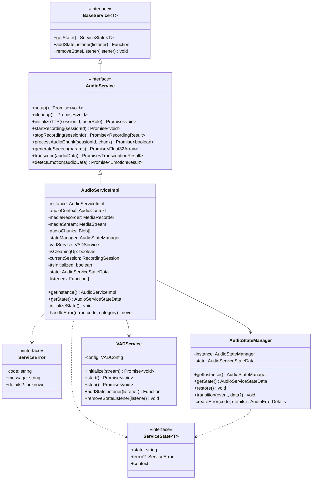
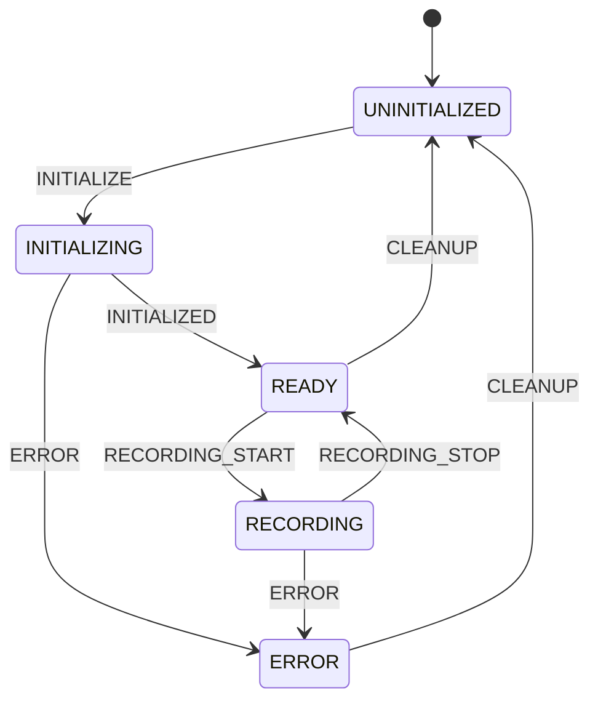
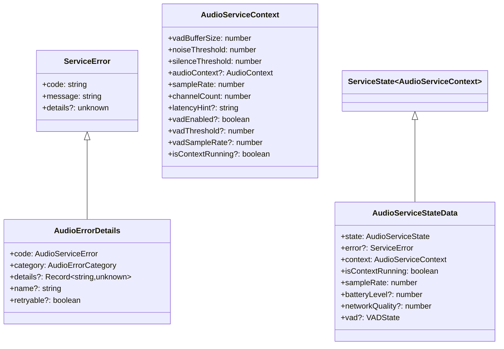
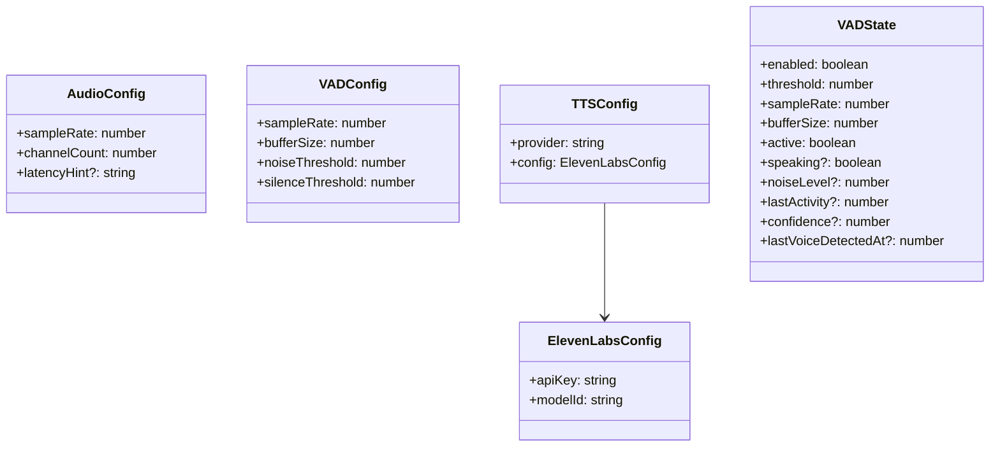
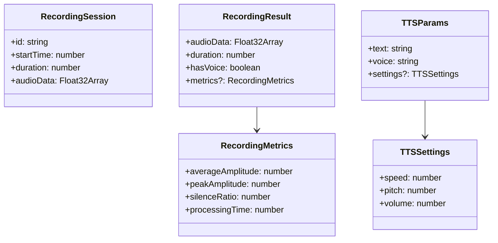
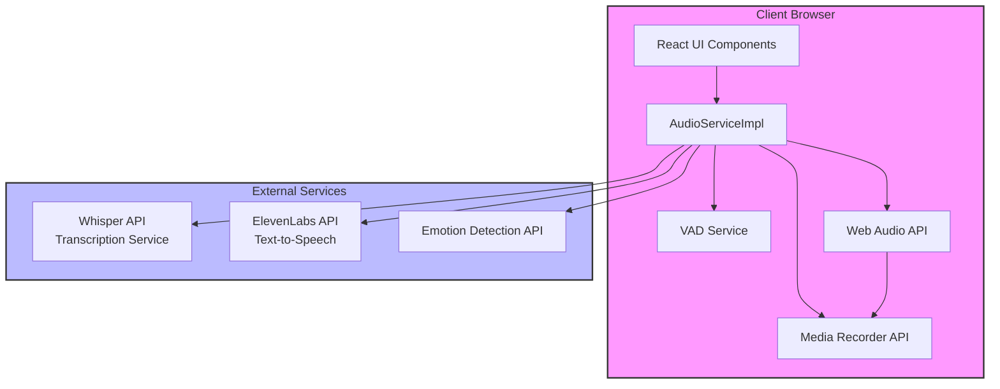

# Codebase Architecture

## Service Architecture



## State and Event Flow



## Type Hierarchy



## Configuration Types



## Session and Result Types



This architecture documentation shows:

1. The core service architecture and inheritance relationships
2. The state machine and event flow of the audio service
3. The type hierarchy and relationships between different interfaces
4. Configuration types used throughout the system
5. Session and result types for recording and TTS operations

The diagrams illustrate how the different components interact and how state flows through the system, making it easier to understand the overall architecture and relationships between different parts of the codebase.

## Deployment Architecture



## System Requirements

### Client-Side Requirements

- Modern web browser with support for:
  - Web Audio API
  - MediaRecorder API
  - WebRTC getUserMedia
  - WebSocket (for real-time communication)
- Minimum browser versions:
  - Chrome 74+
  - Firefox 71+
  - Safari 14.1+
  - Edge 79+

### API Dependencies

1. **Whisper API**

   - Purpose: Speech-to-text transcription
   - Authentication: API key required
   - Rate limits: Based on subscription tier

2. **ElevenLabs API**

   - Purpose: Text-to-speech synthesis
   - Authentication: API key required
   - Rate limits: Based on subscription tier
   - Voice model requirements: Pre-trained models available

3. **Emotion Detection API**
   - Purpose: Audio emotion analysis
   - Authentication: API key required
   - Rate limits: Based on subscription tier

### Performance Requirements

- Audio processing:
  - Sample rate: 44.1kHz or 48kHz
  - Bit depth: 16-bit
  - Channels: Mono/Stereo supported
- Voice Activity Detection (VAD):
  - Buffer size: 2048 samples
  - Processing latency: < 100ms
- Network:
  - Minimum bandwidth: 1 Mbps upload/download
  - Maximum latency: 200ms

## Deployment Steps

1. **Environment Setup**

```bash
# Install dependencies
npm install

# Set up environment variables
cp .env.example .env
# Edit .env with your API keys:
# WHISPER_API_KEY=your_key
# ELEVENLABS_API_KEY=your_key
# EMOTION_API_KEY=your_key
```

2. **Development Build**

```bash
# Start development server
npm run dev

# Run tests
npm test

# Build for production
npm run build
```

3. **Production Deployment**

```bash
# Deploy to production
npm run deploy

# Monitor logs
npm run logs
```

4. **Health Checks**

- Audio system initialization status
- API connectivity tests
- Media device permissions
- WebRTC functionality
- Memory usage monitoring

## Error Recovery

The system implements multiple layers of error recovery:

1. **Connection Issues**

   - Automatic retry with exponential backoff
   - Fallback to cached responses where applicable
   - Graceful degradation of features

2. **Device Errors**

   - Automatic device re-initialization
   - Alternative device selection
   - Clear user feedback and recovery instructions

3. **API Failures**

   - Circuit breaker pattern implementation
   - Queueing of failed requests
   - Alternate API endpoint fallback

4. **Resource Constraints**
   - Automatic cleanup of unused resources
   - Memory usage optimization
   - Background task throttling

## Monitoring and Logging

The system implements comprehensive monitoring:

1. **Performance Metrics**

   - Audio processing latency
   - API response times
   - Memory usage
   - CPU utilization

2. **Error Tracking**

   - API failure rates
   - Device initialization errors
   - Processing pipeline errors

3. **Usage Analytics**

   - Session duration
   - Feature utilization
   - User interaction patterns

4. **Quality Metrics**
   - Audio quality scores
   - Transcription accuracy
   - Emotion detection confidence

The deployment architecture ensures scalability, reliability, and maintainable code structure while providing comprehensive error handling and monitoring capabilities.
